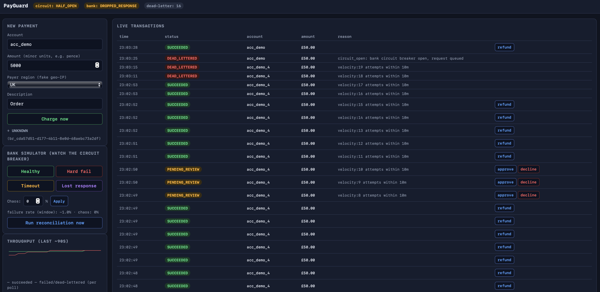

# PayGuard — A Reliable, Fraud-Aware Payment Gateway

A **local-only** Java backend that simulates how a real payment processor moves
money safely: payment-correctness mechanics (idempotency keys, refunds, an
auditable ledger, an explainable fraud screen) combined with site-reliability
engineering (circuit breaker, retry with exponential backoff, dead-letter
queue, health/metrics endpoints, structured failure handling).

> Money must be *correct under failure* — that is what this project is built to
> demonstrate, not to deploy. Everything runs on your machine via Docker.

---

## Quickstart

```bash
# 1. Postgres + the API (this is all you need for the API + dashboard)
docker compose up --build

# 2. Open the dashboard
open http://localhost:8080            # live feed + simulator toggles
# or drive the API directly
curl http://localhost:8080/actuator/health
```

Optional SRE observability stack (Prometheus scraping + Grafana):

```bash
docker compose --profile observability up --build
# Grafana http://localhost:3000  (admin / admin) — Prometheus datasource pre-provisioned
# Prometheus http://localhost:9090
```

### Example request

```bash
curl -s http://localhost:8080/payments \
  -H 'Content-Type: application/json' \
  -H 'Idempotency-Key: demo-order-123' \
  -d '{"accountId":"acc_demo","amountMinor":5000,"currency":"GBP","ipAddress":"203.0.113.10"}'
```

Send the *same* request again and observe the identical response — no second charge.

### The 90-second demo (circuit breaker opening live)

1. Open the dashboard, set **Bank simulator → Hard fail**.
2. Fire a handful of payments from the form — they start failing after retries and
   land in the **Dead-letter queue**.
3. The header badge flips to **circuit: OPEN** and new requests are queued
   instantly instead of hanging.
4. Hit **Healthy**, then press **replay** on the dead-lettered rows — they settle.

---

## Screenshots

| | |
|---|---|
|  | **Live dashboard** — submit payments, watch statuses change, and flip the bank simulator to watch the circuit breaker open and dead letters queue for replay. |
|  | **Grafana** — payment outcomes charted from the app's Prometheus metrics (run with `docker compose --profile observability up`). |

---

## What each piece is for

| Component | Real-world concern |
|---|---|
| DB-backed idempotency keys, refunds, immutable ledger | Money movement must be exactly-once and auditable |
| Explainable fraud rules (velocity, amount z-score, geo-jump) | Fraud controls anyone can understand and override |
| Resilience4j circuit breaker + retry/backoff around the bank simulator | Failing fast to protect the system |
| `/actuator/health`, `/actuator/prometheus`, custom Micrometer metrics | Monitoring, metrics and alerting |
| Dead-letter table + manual replay | Incident handling — keep business-critical systems moving |
| Failure-injection tests | Verifying correct behaviour under dependency faults |

### API surface

| Method & path | Purpose |
|---|---|
| `POST /payments` | Charge (requires `Idempotency-Key` header) |
| `GET /payments/{id}` | Check status |
| `POST /payments/{id}/refund` | Refund a SUCCEEDED payment (once) |
| `GET /admin/transactions` | Recent-transaction feed (dashboard) |
| `GET /admin/dead-letter` | Failed transactions awaiting a decision |
| `POST /admin/dead-letter/{id}/replay` | Re-submit a dead-lettered charge |
| `POST /admin/payments/{id}/approve` | Reviewer approves a fraud-flagged payment (charges it) |
| `POST /admin/payments/{id}/decline` | Reviewer voids a fraud-flagged payment (bank never called) |
| `POST /admin/simulator/mode?mode=...` | `NORMAL` / `HARD_FAIL` / `TIMEOUT` / `DROPPED_RESPONSE` |
| `POST /admin/simulator/chaos` | Inject random failures at a rate |
| `POST /admin/reconciliations/run` | Run the reconciliation job on demand |
| `POST /admin/demo/seed-account` | Seed a history so the fraud rules can fire |
| `/actuator/health`, `/actuator/prometheus`, `/metrics` | Liveness + Prometheus metrics |

### Transaction statuses

`SUCCEEDED` · `PENDING_REVIEW` (fraud, waiting for a human decision) ·
`VOIDED` (declined in review, never charged) · `UNKNOWN` (settled, response
lost) · `DEAD_LETTERED` (needs replay) · `FAILED` (definitively not charged).

### Manual review

When the fraud engine flags a transaction it routes it to `PENDING_REVIEW`
**before** the bank is called, so no money moves until a human decides:

- **Approve** (`POST /admin/payments/{id}/approve`) — the reviewer overrides
  the flag and the payment is charged now; if the bank is unhealthy the usual
  dead-letter and reconciliation paths still apply.
- **Decline** (`POST /admin/payments/{id}/decline`) — the payment is voided
  and the bank is never contacted.

---

## The hard problem: "did I get charged or not?"

A payment request that times out is *ambiguous*: the acquirer may have settled it
just before the reply vanished, in which case retrying double-charges the
customer, while *not* retrying risks losing revenue if it never settled. This is
one of the genuinely hard distributed-systems problems in payments, and PayGuard
reproduces it on purpose.

The simulated bank settles every charge to **its own ledger** *before* producing a
response. In `DROPPED_RESPONSE` mode the charge is written and the response is
then "lost". The gateway therefore never blindly retries a lost response.
Instead it marks the transaction **UNKNOWN** and a reconciliation job
(`ReconciliationRunner`) periodically asks the bank's ledger — the authority —
whether the charge exists for that `bankRequestId`:

```
UNKNOWN ──► look up bankRequestId on bank_ledger ──► found    ? SUCCEEDED  (money moved, charge reference recorded)
                                                  └─► not found? FAILED     (customer was not charged)
```

Because the bank is idempotent on `bankRequestId`, a replayed or reconciled
request can never settle twice. Reconciliation also sweeps orphaned `PENDING`
rows (a crash between allocating the idempotency key and finishing the request)
into the dead-letter queue so nothing stalls silently.

---

## Design decisions (tradeoffs considered)

- **Postgres over NoSQL.** Money needs ACID: idempotency is a unique constraint,
  refunds take a pessimistic lock, and the ledger is append-only. A document
  store would make "charge exactly once under concurrency" an application-level
  nightmare.
- **Rules-based fraud engine over ML.** Every decision must be explainable to an
  investigator (and to an interviewer). Each rule contributes a score and a
  human-readable reason; no black box. Layered signals, not a single verdict.
- **DB-backed idempotency, not an in-memory map.** The unique
  `idempotency_key` on the PENDING row is the lock: exactly one concurrent
  request ever wins it; losers poll for the stored result. Correct across
  instances, not just threads.
- **Circuit breaker outside the retry loop, counting per attempt.** The breaker
  measures the bank's *per-attempt* health and opens quickly under a real
  outage, while retries with exponential backoff absorb transient blips.
  `CallNotPermittedException` is excluded from retries so an open circuit is
  never hammered.
- **Lost responses are not circuit failures.** The bank actually succeeded, so
  `ResponseLost` is ignored by both the breaker and the retry policy and handled
  by reconciliation instead.
- **Small local stack on purpose.** No Kafka, no Kubernetes — the dead-letter
  queue is an in-memory pattern backed by a real table, which keeps
  `docker compose up` the entire story while preserving the engineering idea.
- **Testcontainers for integration tests.** The happy path is tested, but the
  tests that matter force each failure mode (timeout, hard failure, lost
  response, open circuit) and assert the exact final state. If your Docker
  socket is unavailable, point the suite at a running Postgres instead:

  ```bash
  docker compose up -d db
  PAYGUARD_TEST_DB_URL=jdbc:postgresql://localhost:5433/payguard mvn test
  ```

---

## Project layout

```
src/main/java/com/payguard/
├── payment/       controller, service, entity, repo (idempotency logic lives here)
├── fraud/         explainable rules engine + mocked IP→region lookup
├── resilience/    Resilience4j circuit breaker + retry config and executor
├── bank/          simulated downstream bank + its own ledger
├── deadletter/    DLQ entity/repo/service with manual replay
├── reconciliation/ scheduled job that resolves UNKNOWN transactions
├── admin/         dashboard feed, simulator controls, seeding
└── metrics/       custom Micrometer counters/timers
src/test/java/     unit (fraud rules) + integration + failure-injection suites
src/main/resources/db/migration/   schema (Flyway)
src/main/resources/static/         the dashboard (single page, no build step)
```

---

## Tech stack

Java 17 · Spring Boot 3 · Spring Data JPA · PostgreSQL · Flyway ·
Resilience4j · Micrometer/Prometheus · JUnit 5 + Testcontainers · plain
HTML/JS dashboard · Docker Compose.

## How the tests behave

`mvn test` runs **19 tests**: pure unit tests for the fraud rules (no infra),
plus integration/failure-injection tests that prove — against a real Postgres —
a duplicate idempotency key never double-charges (including two *concurrent*
requests for the same key), a lost response resolves to exactly one settlement,
and after the circuit opens every queued transaction replays to SUCCEEDED once
the bank recovers.
